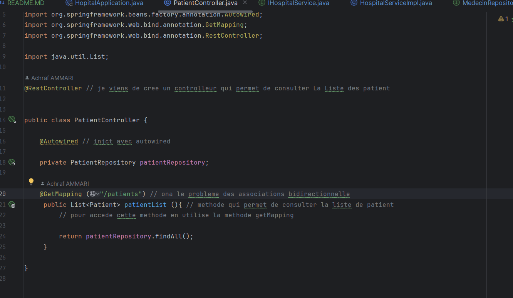

<h4>Mapping Objet Relationnel (ORM), JPA, Hibernate, Spring Data </h4>
<h5> Spring.Data : </h5>

 Spring Data :
• Spring Data est un module de Spring qui a déjà créé des interfaces génériques et des implémentations génériques qui permettent de gérer les entités JPA.
• En utilisant Spring Data, vous n’aurez plus besoin de faire appel à l’objet EntityManager pour gérer la persitence. Spring Data le fait à votre place.
• Spring Data nous évite de créer les interfaces et les implémentation JPA de la couche DAO.
• Il suffit de créer une interface qui hérite de l’interface JPARepository pour hériter toutes les méthodes classiques qui permettent de gérer les entités JPA.
• En cas de besoin, vous avez la possibilité d’ajouter d’autres méthodes en les déclarant à l’intérieur de l’interface JPARepository, sans avoir besoin de les implémenter. Spring Data le fera à votre place

<h4> L'ensemble des Entités JPA : </h4>

<h8> L'Entité Patient </h8>

<h8> L'Entité Medecin:</h8>

<h8> L'Entité RendezVous:</h8>

<h8> L'Entité Consultation:</h8>

<h5> L'ensemble des Repository  : </h5>

<h8> PatientRepository ::</h8>

<h8> MedecinRepository ::</h8>

<h8> ConsultationRepository ::</h8>

<h8> RendezVousRepository ::</h8>

<h5> La Couche Service : </h5>

<h3>L'implémentation de L'interface IService : </h3>

<h5> Partie Web  : </h5>
<h6> Patient Controller : </h6>

<h6> Hopital Application </h6>

<h6> Server Port </h6>

<h6> Results</h6>

<

